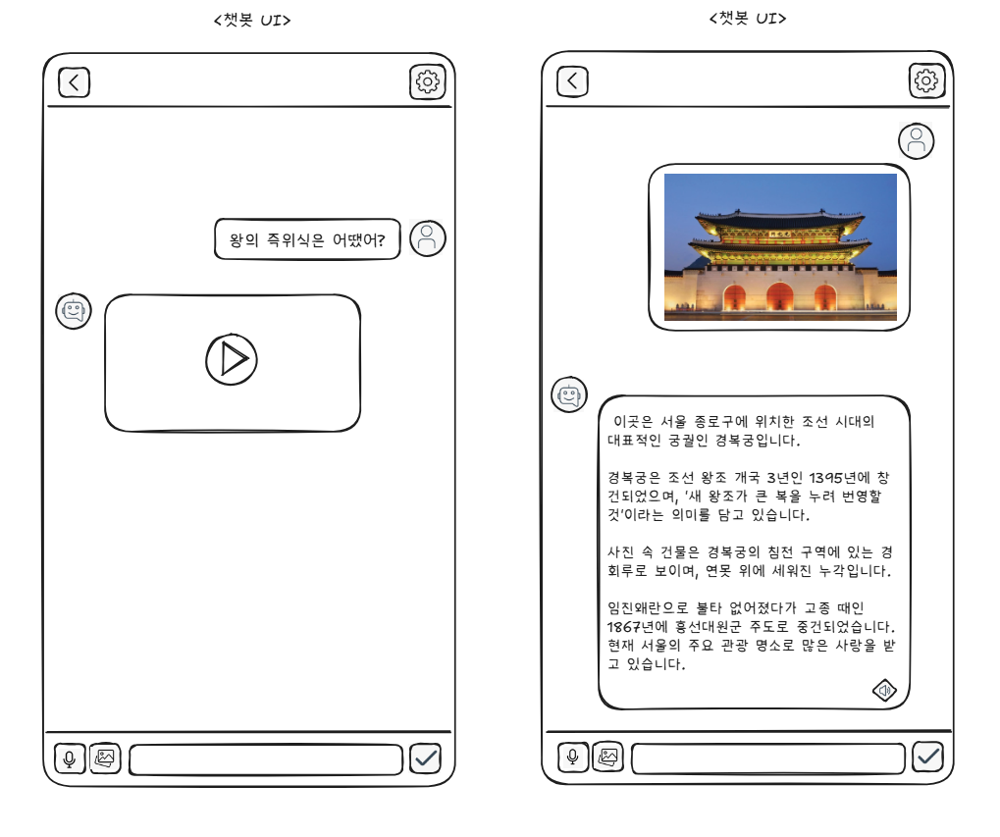

# 2025년 새싹 해커톤(SeSAC Hackathon) AI 서비스 기획서

| | |
|---|---|
| **팀명** | **타임 브릿지** |
| **팀 구성원** | **이화진, 이도형, 변정민** |

---

### 1. AI 서비스 명칭
"한양에서 왔습니다~ "

---

### 2. 활용 인공지능 학습용 데이터

| No. | 활용 데이터명 | 분야 | 출처 |
|:---:|---|---|---|
| 1 | 조선왕조실록 | 역사 | 국사편찬위원회 |
| 2 | 서울 사랑 매거진 | 관광/문화 | 서울특별시 |

---

### 3. 핵심내용
대한민국 고궁의 역사와 배경을 재미있게 풀어주는 "한양에서 왔습니다~" 서비스는 서울의 5대 고궁을 단순한 관광지가 아닌 **"살아 있는 역사 이야기 공간"**으로 재탄생시키는 것을 목표로 합니다. 각 궁궐의 건축적 특징, 역사적 배경, 왕과 인물들의 숨은 이야기를 **영상, 음성, 텍스트**를 통해 사용자와 쌍방향으로 소통하며 흥미롭게 전달합니다.

---

### 4. 제안배경 및 목적
#### 가. 제안배경 (Problem)
스마트폰으로 모든 것을 검색하는 시대이지만, 고궁과 같은 역사 공간에서의 경험은 여전히 일방적인 정보 전달에 머물러 있습니다.
- **2030 여행객**들은 안내판만 읽기엔 지루하고, 사진만 찍기엔 아쉬움을 느낍니다.
- **자녀 동반 가족**들은 아이들의 눈높이에 맞는 흥미로운 설명에 대한 니즈가 큽니다.
- **외국인 관광객**들은 정해진 오디오 가이드를 넘어, K-드라마에서 본 장면에 대한 비하인드 스토리처럼 깊이 있는 정보를 원합니다.

기존의 관람 방식은 사용자의 즉각적이고 개인적인 궁금증을 해결해주지 못하며, 이는 역사에 대한 심리적 장벽과 지루함을 유발하는 핵심적인 문제입니다.

#### 나. 목적 (Goal)
본 서비스는 위와 같은 문제점을 해결하기 위해, 사용자가 궁금해하는 질문의 니즈에 맞는 답변을 실시간으로 제공하는 AI 서비스를 만들고자 합니다. 일방적인 정보 제공자를 넘어, 사용자와 소통하는 AI 스토리텔링 가이드를 통해 누구나 역사를 쉽고 재미있게 즐기는 새로운 관람 문화를 만드는 것을 목적으로 합니다.

---

### 5. 세부내용
#### 가. 활용 데이터 및 AI 모델
- **활용 데이터**: 상기 '2번 항목'에 명시된 `조선왕조실록`, `서울 사랑 매거진` 데이터 활용
- **AI 모델**:
    - **Vertex AI (Gemini & Veo)**: 생성형 AI를 통해 멀티모달(텍스트, 음성, 영상) 답변 생성
    - **RAG (Retrieval-Augmented Generation)**: 조선왕조실록 등 방대한 역사 데이터를 정확하게 참조
    - **Langchain**: RAG 파IP라인을 구축하여 AI 모델이 학습 데이터를 효과적으로 참조하도록 서비스의 기반을 구성

#### 나. 서비스 아이디어 개요 (적용기술 및 서비스 방법)
**"궁금할 때 바로 물어보는 AI 도슨트, 왕에게 직접 듣는 경복궁의 비밀 이야기"**
사용자가 고궁 내 특정 장소에서 스마트폰을 통해 질문(텍스트, 음성, 이미지)을 하면, AI가 해당 장소와 관련된 인물(왕, 신하 등)의 페르소나와 목소리로 답변합니다. "왕의 즉위식은 어땠어?"와 같은 시각적 설명이 필요한 질문에는 짧은 영상을 생성하여 보여주고, "근처 맛집 알려줘"와 같이 대화의 맥락에 맞는 주변 장소도 추천하며 경험을 확장시킵니다.

#### 다. 서비스의 예상 UI/UX 이미지 시각화


---

### 6. 기대효과
#### 가. 사회/경제적 파급(기대) 효과
- **관광 서비스 활성화**: 개인 맞춤형 정보 제공으로 관람 만족도를 높여 고궁 방문객 증대에 기여하고, 체류 시간을 늘려 주변 상권 및 **지역 경제 활성화**를 촉진합니다.
- **스마트 문화 관광 선도**: AI 기술을 문화유산에 접목한 성공 사례를 제시하여, 대한민국의 스마트 관광 경쟁력을 강화하는 선도 모델이 될 수 있습니다.
- **문화적 가치 창출**: 내/외국인 모두에게 대한민국 역사를 생생하고 재미있는 경험으로 제공함으로써, 문화적 자긍심을 고취하고 국가 이미지를 제고하는 데 기여합니다.

---

### 7. 기술 아키텍처 (GCP 기반)

본 서비스는 Google Cloud Platform(GCP)의 관리형 서비스들을 적극적으로 활용하여, 안정적이고 확장성 높은 서버리스 아키텍처로 설계되었습니다.

```mermaid
graph TD
    subgraph "Client"
        A[모바일 앱]
    end

    subgraph "GCP (Google Cloud Platform)"
        B[API Gateway]
        C[Cloud Run]
        D[Vertex AI Gemini API]
        E[Vertex AI Veo API]
        F[Cloud Speech-to-Text]
        G[Cloud Text-to-Speech]
        H[Vertex AI Vector Search]
        I[Cloud SQL for PostgreSQL]
    end

    subgraph "Data Sources"
        J[조선왕조실록]
        K[서울 사랑 매거진 (CSV)]
    end

    A -- "REST API 요청 (HTTP/S)" --> B
    B -- "라우팅" --> C
    
    C -- "1. 페르소나 적용 RAG 질의" --> D
    C -- "2. 영상 생성 요청" --> E
    C -- "3. 음성 -> 텍스트 변환" --> F
    C -- "4. 텍스트 -> 음성 변환" --> G
    C -- "5. 유사 문서 검색 (Embedding)" --> H
    C -- "6. 위치 기반 장소 추천 쿼리" --> I
    
    D -- "LLM 답변 생성" --> C
    E -- "영상 URL 반환" --> C
    F -- "변환된 텍스트 반환" --> C
    G -- "생성된 음성 파일 반환" --> C
    H -- "검색된 문서 반환" --> C
    I -- "추천 장소 목록 반환" --> C

    J -- "ETL & 임베딩" --> H
    K -- "ETL & 정제" --> I

    style A fill:#D6EAF8,stroke:#3498DB
    style J fill:#FDEDEC,stroke:#E74C3C
    style K fill:#FDEDEC,stroke:#E74C3C
```

**주요 흐름:**

1.  **사용자 요청:** 클라이언트(모바일 앱)는 API Gateway를 통해 Cloud Run에 배포된 백엔드 서버로 요청을 보냅니다.
2.  **질의응답 (RAG):**
    *   Cloud Run은 사용자의 질문을 기반으로 Vertex AI Vector Search에서 관련성이 높은 역사 문서(조선왕조실록)를 검색합니다.
    *   검색된 문서와 사용자 질문을 '세종대왕 페르소나' 프롬프트와 함께 Vertex AI Gemini API로 전달하여 자연스러운 답변을 생성합니다.
3.  **멀티모달 기능:**
    *   **음성:** Cloud Speech-to-Text와 Text-to-Speech API를 사용하여 음성 질의응답을 처리합니다.
    *   **영상:** "즉위식 보여줘"와 같은 특정 키워드가 포함된 경우, Vertex AI Veo API를 호출하여 짧은 영상을 생성하고 URL을 반환합니다.
4.  **장소 추천:**
    *   "근처 맛집 알려줘"와 같은 요청 시, Cloud Run은 사용자의 위도/경도 값을 사용하여 Cloud SQL(PostgreSQL)에 저장된 '서울 사랑 매거진' 데이터를 쿼리합니다.
    *   Geospatial 쿼리를 통해 가장 가까운 장소를 계산하여 추천 목록을 반환합니다.

